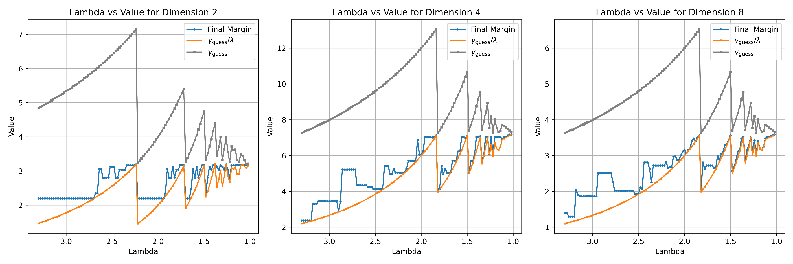

[TOC]

## Usage

To run the code, use:

```
make run
```

To delete the excutable, use:

```
make clean
```

## Deliverables

- An executable program `perceptron`
- A readme file `README.md`
- Source code `main.cpp`
- A report explaining the margin of your classifier for each of the three datasets `report.txt`

## Appendix

### 1. Expand the (1/4)-approximation algorithm 

we expand the (1/4)-approximation algorithm to 1 / (λ^2)-approximation. (λ>1)

**a. margin perceptron (modified):**

```pseudocode
# Initialization
w = 0
# Main loop: iterate until no violation points are found
while True:
    violation_found = False
    # Loop through all points p in the set S
    for p in S:
        # Check if p is a violation point
        if (distance(w, p) < γ_guess / λ) or # Here: γ_guess/2 --> γ_guess/λ
           (p.label == 1 and dot(w, p) < 0) or
           (p.label == -1 and dot(w, p) > 0):        
            violation_found = True
            # Update w based on the label of p
            if p.label == 1:
                w = w + p
            else:
                w = w - p
    # If no violation points are found, the algorithm terminates
    if not violation_found:
        break
```

**Theorem**: If `γ_guess` ≤ `γ_opt`, margin perceptron terminates in at most
$$
\frac{(c\lambda+2)}{2}·\frac{1}{(1-\frac{c+1}{c\lambda})}·\frac{R^2}{\gamma_{opt}^2} \space (c>0, \lambda > \frac{c+1}{c})
$$
iterations and returns a separation plane with margin at least `γ_guess/λ` .

**Proof**:

**Claim 1(same):**
$$
|w_k | ≥ w_k · u ≥ kγ_{opt}.
$$
**Claim 2(same):**

$$
|w_{i+1}| ≤ |w_i| + R
$$
**Claim 3:**
$$
|w_{i+1}| ≤ |w_i| + \frac{R^2}{2|wi|} + \frac{γ_{opt}}{\lambda}
$$
Proof: We will prove only the case where `w_{i+1}` is adjusted from `w_i` using a violation point p of label 1. In other words, `w_{i+1}` = `w_i` + p. Hence:
$$
|w_{i+1}|^2 = |w_i|^2 + 2w_i·p + |p|^2
$$
Since p is a violation point, it must hold that:
$$
\frac{w_i}{|w_i|} · p < \frac{γ_{guess}}{λ} ≤ \frac{γ_{opt}}{λ}
$$
 Furthermore, obviously, |p|^2 ≤ R^2 . We thus have:
$$
|w_{i+1}|^2 ≤ |w_i|^2 + \frac{2γ_{opt}|w_i|}{λ} + R^2 ≤ (|w_i| + \frac{R^2}{2|w_i|} + \frac{\gamma_{opt}}{\lambda})^2
$$


The claim then follows.

**Claim 4:**
$$
When\space |w_i| ≥ \frac{c\lambda R^2}{2γ_{opt}}, |w_{i+1}| ≤ |w_i| + (\frac{c+1}{c}·\frac{1}{\lambda})γ_{opt}\space\space (c>0)
$$


Directly follows from Claim 3.

**Claim 5:** 
$$
|w_k| ≤ \frac{c\lambda R^2}{2γ_{opt}} + \frac{(c+1)}{c\lambda} k\gamma_{\text{opt}} + R.
$$
Proof: Let j be the largest i satisfying |wi| < cλR^2/2`γ_opt`. If j = k, then |w_k| < cλR^2/2`γ_opt` , and we are done. Next, we focus on the case j < k; note that this means |`w_{j+1}`|, |`w_{j+2}`|, ..., |`w_k`| are all at least cλR^2/2`γ_opt`.
$$
\begin{align*}
|w_k| 
&\leq |w_{k-1}| + \frac{(c+1)}{c\lambda} \gamma_{\text{opt}} \quad \text{(Claim 4)} \\
&\leq |w_{k-2}| + 2 \frac{(c+1)}{c\lambda} \gamma_{\text{opt}} \quad \text{(Claim 4)} \\
&\vdots \\
&\leq |w_{j+1}| + (k-j-1)\frac{(c+1)}{c\lambda} \gamma_{\text{opt}} \quad \text{(Claim 4)} \\
&\leq |w_{j+1}| + \frac{(c+1)}{c\lambda} k\gamma_{\text{opt}} \\
&\leq |w_j| + R + \frac{(c+1)}{c\lambda} k\gamma_{\text{opt}} \quad \text{(Claim 2)} \\
&\leq \frac{c\lambda R^2}{2γ_{opt}} + R + \frac{(c+1)}{c\lambda} k\gamma_{\text{opt}}.
\end{align*}
$$
**Combining Claims 1 and 5:**
$$
\begin{align}
|w_k | &≥ w_k · u ≥ kγ_{opt} \quad \text{(Claim 1)}\\
|w_k| &≤ \frac{c\lambda R^2}{2γ_{opt}} + \frac{(c+1)}{c\lambda} k\gamma_{\text{opt}} + R. \quad \text{(Claim 5)}
\end{align}
$$
gives:
$$
\begin{align*}
kγ_{opt} &\leq \frac{c\lambda R^2}{2γ_{opt}} + \frac{(c+1)}{c\lambda} k\gamma_{\text{opt}} + R ⇒\\
(1-\frac{c+1}{c\lambda})k &\leq \frac{c\lambda R^2}{2γ_{opt}^2}+\frac{R}{γ_{opt}} \\
&\leq \frac{(c\lambda+2) R^2}{2\gamma_{opt}^2}(by\space R \geq \gamma_{opt})\\ 
\end{align*}
$$
when:
$$
(1-\frac{c+1}{c\lambda}) > 0  ⇒ \lambda > \frac{c+1}{c}
$$
we have:
$$
k\leq \frac{(c\lambda+2)}{2}·\frac{1}{(1-\frac{c+1}{c\lambda})}·\frac{R^2}{\gamma_{opt}^2}·
$$
**As c goes up, λ can get closer and closer to 1. And the final margin (≥ `γ_guess`/λ) will get closer and closer to `γ_guess` **

This completes the proof of the theorem.

**b. The algorithm to estimate `γ_opt` up to a factor of 1/λ  (λ > 1).**

```pseudocode
R = max_distance_from_origin(S)
γ_guess = R

# Run the margin Perceptron with parameter γ_guess
while True:
    π = run_margin_perceptron(S, γ_guess)

    # Self-Termination: If the Perceptron successfully terminates
    if algorithm_terminates(π):
        return π  # Return the final plane π

    # Forced-Termination: If the algorithm does not terminate after a set number of iterations
    max_iterations = coefficient * (R^2) / γ_guess^2
    if iterations_exceed_limit(max_iterations):
        # Stop the algorithm manually
        γ_guess = γ_guess / λ  # modified
        continue  # Repeat the process

```

**Theorem**: Our incremental algorithm returns a separation plane with margin at least `γ_opt/λ^2`. Furthermore, it performs O(R^2/γ_opt^2) iterations in total (including all the repeats at Line 3).

**Proof**:

Suppose that we repeat `run_margin_perceptron(S, γ_guess)` in total h times. For each i ∈ [1, h], denote by γi the value of `γ_guess` at the i-th time we execute it. By the fact that the (i − 1)-th repeat required a forced termination, we know that `γ_h−1` > `γ_opt`. Hence, `γ_h` = `γ_h−1`/λ > `γ_opt`/λ. It thus follows that the plane we return must have a margin at least `γ_h` / λ > `γ_opt`/λ^2.

The total number of iterations performed is
$$
O\left( \sum_{i=1}^{h} \frac{c_i*R^2}{\gamma_i^2} \right) 
= O\left( \frac{R^2}{\gamma_h^2} + \frac{R^2}{λ^2\gamma_h^2} + \frac{R^2}{λ^4 \gamma_h^2} + \dots \right)
= O\left( \frac{R^2}{\gamma_h^2} \right) = O\left( \frac{R^2}{\gamma_{\text{opt}}^2} \right)
$$
### 2. From theory to reality

**Question 1:** how does lambda influence the final margin in experiment ?

set c = 100, which means `λ > 1.01`.  run the code with different λ (from 3.3 to 1.01)

```c++
//try different lambda
while(lambda > 1.01){ //lambda > c+1/c, set c = 100
    double gamma_guess = R;
    cout << "lambda = " << lambda << endl;
    // Iteratively adjust gamma_guess
    while (true) {
        // Reset weight vector
        w.assign(dimension, 0.0);

        // Run Margin Perceptron
        bool converged = marginPerceptron(trainData, w, gamma_guess, lambda, R);

        // Calculate the final margin
        double final_margin = calculateFinalMargin(trainData, w);

        // Check if conditions are met
        if (converged) {
            // Accept the result and break the loop
            cout << "Final margin after convergence: " << final_margin << endl;
            break;
        } else {
            // Reduce gamma_guess and try again
            gamma_guess /= lambda;
            cout << "Reducing gamma_guess to " << gamma_guess << " and restarting." << endl;
        }
    }
    ...
    //update lambda
    lambda -= 0.01;
}

// Margin Perceptron Algorithm
bool marginPerceptron(vector<Point>& data, vector<double>& w, double gamma_guess, double Lambda, double R) {
    int iteration = 0;
    double coefficient = (50 * Lambda * Lambda + Lambda) / (Lambda - 1);// c=100
    int max_iterations = static_cast<int>(coefficient * (R * R) / (gamma_guess * gamma_guess));
    ...
    do {
        ...
        // Run margin perceptron with parameter gamma_guess
        for (const auto& p : data) {
            double wx = dotProduct(w, p.features);
            double dist = abs(wx)/norm_w;
            // Check for violations
            if (dist < gamma_guess / Lambda || (p.label == 1 && wx < 0) || (p.label == -1 && wx > 0)) {
                // Update weight vector w based on the violation
                for (size_t i = 0; i < w.size(); ++i) {
                    w[i] += p.label * p.features[i];  // w = w + y * x
                }
                violations_found = true;
                break;
            }
        }
        iteration++;

        // Forced termination condition
        if (iteration >= max_iterations) {
            cout << "Forced termination after " << iteration << " iterations." << endl;
            forced_termination = true;
            break;
        }
    } while (violations_found);
    ...
    return !forced_termination;  // Return true if converged without forced termination
}
```

result:


The figure indicates that: The final margin vibrates as λ goes from 3.3 to 1.01. Sometimes the final margin generated with a relatively big λ(e.g λ = 2) might be close to that with the γ_opt. This tells us that in reality, smaller λ is not necessarily better than bigger ones. Because as λ get closer to 1, the algorithm takes more adjustment to terminate.

**Question 2:** Does the algorithm truly return a separation plane with a margin equal to or graeter than `γ_guess` / λ when it terminates? If so, does this result necessarily require that `γ_guess` is less than or equal to `γ_opt` ? (Assuming that γ_opt is equal to the final margin when λ = 1.01. According to the theory, at that point, the algorithm should return a separation plane with a margin of at least `γ_opt` / (1.01)^2, which is very close to `γ_opt`.)

result:



The figure demonstrates that when the algorithm terminates, it consistently returns a separation plane with a margin >= `γ_guess / λ`, which aligns with the theoretical predictions. However, it appears that  `γ_guess`  is consistently larger than  `γ_opt`, which deviates from the theoretical expectation that `γ_guess` should be less than or equal to `γ_opt`.

> Because theory is always conservative. The condition `γ_guess <= γ_opt` in the theory is constructed from a need for the proof. It says if the condition is met, we can definitely achieve something; Yet it doesn't means that if the condition is not met, we cannot get the same result. (**sufficient condition**)

### 3. Summary

- Theory is simplified, but reality is more complex. There are more details about implementation.
- Theory can be used as a guideline, a solid backbone, but not a 100% ensurance.
- I should try to understand that theory is **constructed**. 
