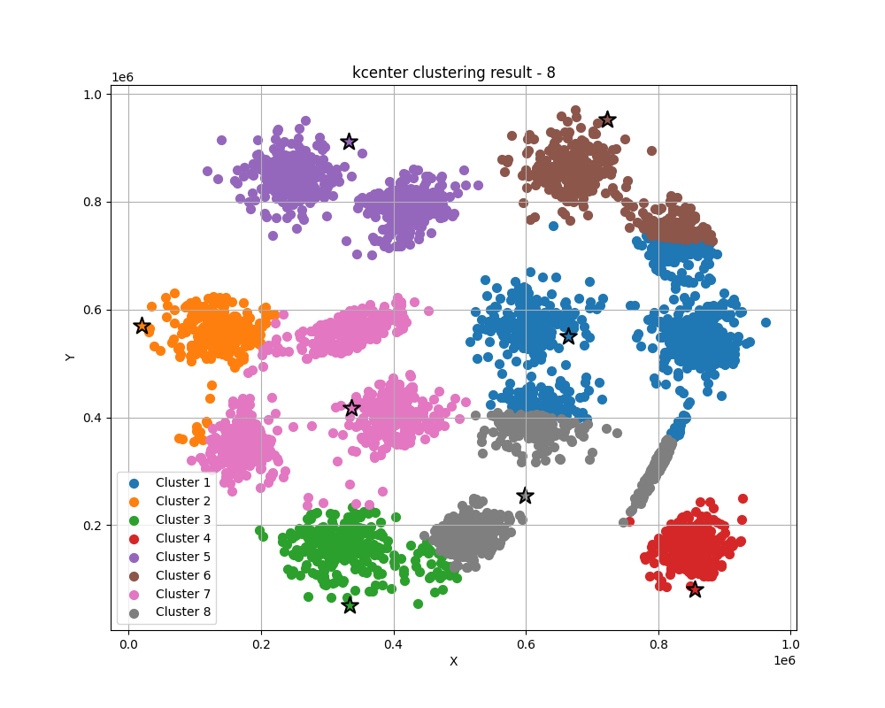

# Usage

## Part I

To run the code, use:

```
python3 preprocess.py
make run
```

To delete the excutable, use:

```
make clean
```

### Output:

```
The prediction error rate is 0.241501
report file report.txt successfully generated.
```

### Deliverables

- An executable program `bayesian_classifier`
- A readme file `README.md`
- Source code `main.cpp` and Makefile
- A file `report.txt` on using the program to classify the records of the evaluation set.

## Part II

To run the code, use:

```
make run
```

To delete the excutable, use:

```
make clean
```

To visualize the clustering result, use

```
python3 plot.py #you need to specify the input in main. See source code for details.
```

### Output:

```
//k-center
report file kcenter-report.txt successfully generated.
//k-means
report file kmeans-report.txt successfully generated.
```

To change the mode, you need do some modification in main as follows:

```c++
int main(){
    //load dataset
    vector<point>dataset;
    string input_path = "../dataset.txt", output_path = "kmeans-report.txt";//output_path need modify
    if(load_data(input_path, dataset)){
        cerr << "Error: Fail to load data" << endl;
        exit(1);
    }
    //perform clusttering
    centriods C;
    //1.k-center
    //k_center(dataset, C, 8);
    //2.k-means
    k_means(dataset, C, 8);//comment or uncomment these two

    //generate report
    if(generate_report(dataset, C, K_MEANS, output_path)){//change report mode K_MEANS & K_CENTER
        cerr << "Error: Fail to generate report" << endl;
        exit(1);
    }else{
        cout << "report file " << output_path << " successfully generated." << endl;
    }

    return 0;
}
```

### Deliverables

- An executable program `clustering`
- A readme file `README.md`
- Source code `main.cpp` and Makefile
- Report file `kmeans-report.txt` and `kcenter-report.txt` for the clustering results.

### Results

1. k-center (k = 8)




2. k-means (k = 8)

