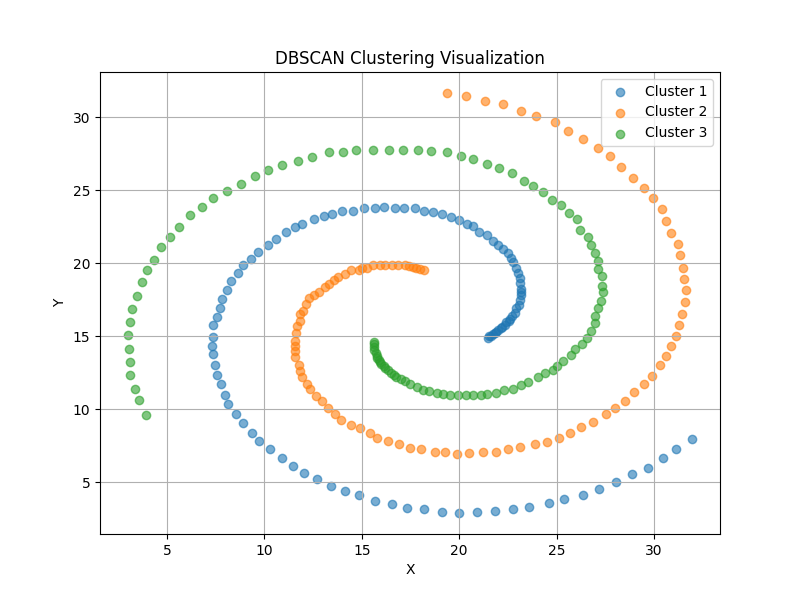

# Usage

> Tasks: 
>
> 1. implement DBSCAN with naive indexing method (√)
> 2. implement DBSCAN with `R*-tree` indexing method try [libspatialindex/libspatialindex: C++ implementation of R*-tree, an MVR-tree and a TPR-tree with C API](https://github.com/libspatialindex/libspatialindex) (x)
> 3. implement DBSCAN with genuine O(nlogn) (x)
> 4. implement ρ-approximation DBSCAN (x)
> 5. Find different dataset to test the above 4 approach. (x)

**Most Interested**: How to measure the **hardness** of a **problem** ?

To run the code, use:

```
make run
```

To delete the excutable, use:

```
make clean
```

To visualize the clustering result, use:

```
python3 plot.py
```

### Output:

```
report file report.txt successfully generated.
```

### Deliverables

- An executable program `dbscan`
- A readme file `README.md`
- Source code `main.cpp` and Makefile
- A file `report.txt` on using the program to classify the records of the evaluation set.

### Results


